Hello! I am [Bérénice](http://bebatut.fr/), the author of following slides.

<small>
This slide does not exist in original deck. It is useful if you are not familiar with [Reveal.JS](https://github.com/hakimel/reveal.js), used here.
</small>

The easiest way to navigate this slide deck is by hitting `[space]`on your keyboard.

---

### Docker, its possibilities and how to start

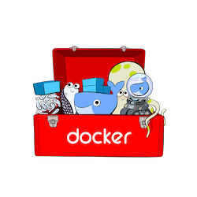

Bérénice Batut

<small>
University of Freiburg<br><br>3rd Systems Biology Developers Foundry <br>Frankfurt - December 2016
</small>

Note: How many of you have already
- heard about Docker?
- used Docker?
- create a Docker container?

---

## <i class="fa fa-calendar-o"></i> Agenda

1. Why Docker? What is it?
2. How to use Docker?
3. How to containerize your tools?

---

## Why Docker? <br>What is it?

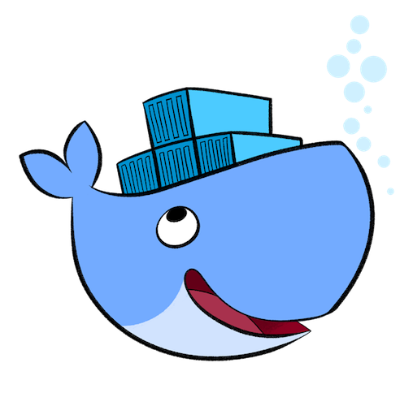

----

### Reproducibility in bioinformatics

Deployment issues
- Different environment
- Different OS
- Different packaging
- Conflict between tools or versions

----

### Deployment issue


----

### Deployment issue

Matrix from Hell


----

### Transport Pre 1960


----

### Transport Pre 1960

Matrix from Hell


----

### Intermodal shipping container


Note: A standard container that is loaded with virtually any goods and stays sealed until it reaches final delivery. In btw can be loaded and unloaded, stacked, transported efficiently over long distances and transferred from one mode of transport to another

----

### Docker


Note: An engine that enables any payload to be encapsulated as a lightweight, portable, self sufficient container, that can be manipulated using standard operations and run consistently on virtually any hardware platform

----

### A Docker container?

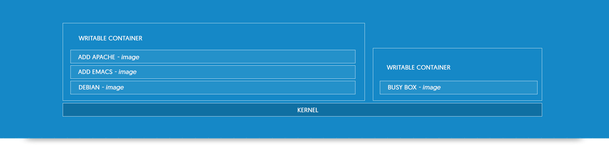

Lightweight, Open, Secure by default

Note:
- lightweight: same OS kernel, instant start, less RAM use
- open: open standard, run on all major unix distributions and windows
- secure by default: containers isolate applications from one another and the underlying infrastructure

----

### Virtual machines vs Containers

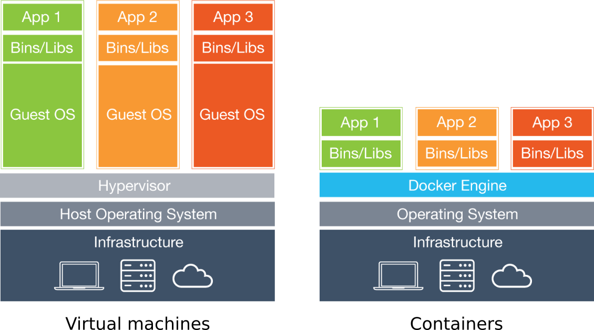

Containers more portable and efficient

Note:
- Similar resource isolation and allocation benefits for containers and VM
- but a different architectural approach
- VM: include the application, the necessary binaries and libraries, and an entire guest operating system -- all of which can amount to tens of GBs
- Container: application and all of its dependencies --but share the kernel with other containers, running as isolated processes in user space on the host operating system

---

## How to use Docker?


----

### The client

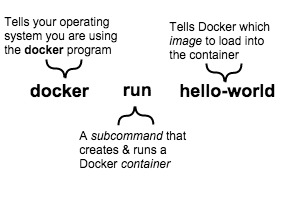

Note: Add a scheme?

----

### Containers? Images?

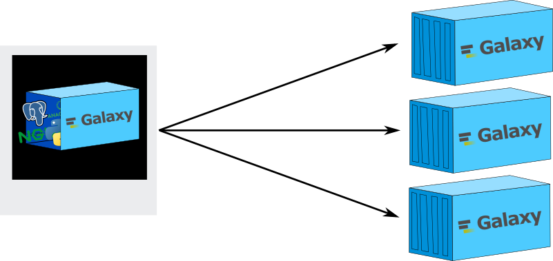

----

### How to get images?

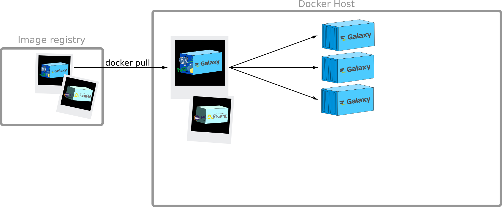

----

### `docker pull`

```sh
bebatut$ docker pull hello-world
Using default tag: latest
latest: Pulling from library/hello-world
c04b14da8d14: Pull complete
Digest: sha256:0256e8a36e2070f7bf2d0b0763dbabdd67798512411de4cdcf9431a1feb60fd9
Status: Downloaded newer image for hello-world:latest
```

----

### Creation of containers


----

### `docker run`

```sh
bebatut$ docker run hello-world

Hello from Docker!
This message shows that your installation appears to be working correctly.

To generate this message, Docker took the following steps:
 1. The Docker client contacted the Docker daemon.
 2. The Docker daemon pulled the "hello-world" image from the Docker Hub.
 3. The Docker daemon created a new container from that image which runs the
    executable that produces the output you are currently reading.
 4. The Docker daemon streamed that output to the Docker client, which sent it
    to your terminal.

To try something more ambitious, you can run an Ubuntu container with:
 $ docker run -it ubuntu bash

Share images, automate workflows, and more with a free Docker Hub account:
 https://hub.docker.com

For more examples and ideas, visit:
 https://docs.docker.com/engine/userguide/
```
----

### `docker run`

```sh
bebatut$ docker run docker/whalesay cowsay Galaxy
Unable to find image 'docker/whalesay:latest' locally
latest: Pulling from docker/whalesay
e190868d63f8: Pull complete
909cd34c6fd7: Pull complete
0b9bfabab7c1: Pull complete
a3ed95caeb02: Pull complete
00bf65475aba: Pull complete
c57b6bcc83e3: Pull complete
8978f6879e2f: Pull complete
8eed3712d2cf: Pull complete
Digest: sha256:178598e51a26abbc958b8a2e48825c90bc22e641de3d31e18aaf55f3258ba93b
Status: Downloaded newer image for docker/whalesay:latest
 ________
< Galaxy >
 --------
    \
     \
      \
                    ##        .
              ## ## ##       ==
           ## ## ## ##      ===
       /""""""""""""""""___/ ===
  ~~~ {~~ ~~~~ ~~~ ~~~~ ~~ ~ /  ===- ~~~
       \______ o          __/
        \    \        __/
          \____\______/
```

Note:
- Automatic `pull` if image not findable
- Interaction with the container to say something

----

### `docker run`

```sh
bebatut$ docker run --help

Usage:	docker run [OPTIONS] IMAGE [COMMAND] [ARG...]

Run a command in a new container

  -a, --attach=[]                 Attach to STDIN, STDOUT or STDERR
  --add-host=[]                   Add a custom host-to-IP mapping (host:ip)
  --cpu-shares                    CPU shares (relative weight)
  ...
  -d, --detach                    Run container in background and print container ID
  -e, --env=[]                    Set environment variables
  --entrypoint                    Overwrite the default ENTRYPOINT of the image
  --env-file=[]                   Read in a file of environment variables
  ...
  -h, --hostname                  Container host name
  -i, --interactive               Keep STDIN open even if not attached
  --name                          Assign a name to the container
  --net=default                   Connect a container to a network
  ...
  -P, --publish-all               Publish all exposed ports to random ports
  -p, --publish=[]                Publish a container's port(s) to the host
  --privileged                    Give extended privileges to this container
  --rm                            Automatically remove the container when it exits
  -t, --tty                       Allocate a pseudo-TTY
  -v, --volume=[]                 Bind mount a volume
  ...
```

----

### Run an interactive container

```sh
bebatut$ docker run -t -i docker/whalesay
root@7de97f8dd5eb:/cowsay#
root@7de97f8dd5eb:/cowsay# cowsay Galaxy
 ________
< Galaxy >
 --------
    \
     \
      \
                    ##        .
              ## ## ##       ==
           ## ## ## ##      ===
       /""""""""""""""""___/ ===
  ~~~ {~~ ~~~~ ~~~ ~~~~ ~~ ~ /  ===- ~~~
       \______ o          __/
        \    \        __/
          \____\______/
root@7de97f8dd5eb:/cowsay#
```

----

### Control during startup

```
bebatut$ docker run -i -t
    -p 8080:80 -p 8021:21 -p 9002:9002
    --privileged=true
    -e "NONUSE=reports"
    -e "GALAXY_CONFIG_ADMIN_USERS=albert@einstein.gov"
    -e "GALAXY_CONFIG_MASTER_API_KEY=83D4jaba7330aDKHkakjGa937"
    -e "GALAXY_CONFIG_BRAND='My own Galaxy flavour'"
    -e "GALAXY_LOGGING=full"

    quay.io/bgruening/galaxy
```

----

### Management of data

```sh
bebatut$ mkdir data
bebatut$ docker run docker/whalesay cowsay Galaxy > data/cowsay
bebatut$ more data/cowsay
 ________
< Galaxy >
 --------
    \
     \
      \
                    ##        .
              ## ## ##       ==
           ## ## ## ##      ===
       /""""""""""""""""___/ ===
  ~~~ {~~ ~~~~ ~~~ ~~~~ ~~ ~ /  ===- ~~~
       \______ o          __/
        \    \        __/
          \____\______/
bebatut$ docker run -t -i docker/whalesay
root@f4fa8ed32ef8:/cowsay# ls
ChangeLog  INSTALL  LICENSE  MANIFEST  README  Wrap.pm.diff  cows  cowsay  cowsay.1  install.pl  install.sh  pgp_public_key.txt
root@f4fa8ed32ef8:/cowsay# cowsay Hello Galaxy > cowsay2
```

Can we access the `cowsay` file inside the container? <br>And the `cowsay2` file outside the container?

----

### Management of data

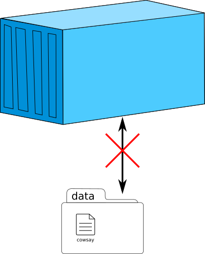

Note: A container is closed

----

### Management of data

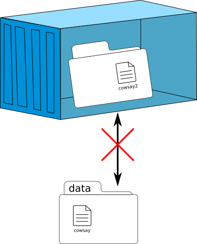

Note: A container is closed

----

### Data volume

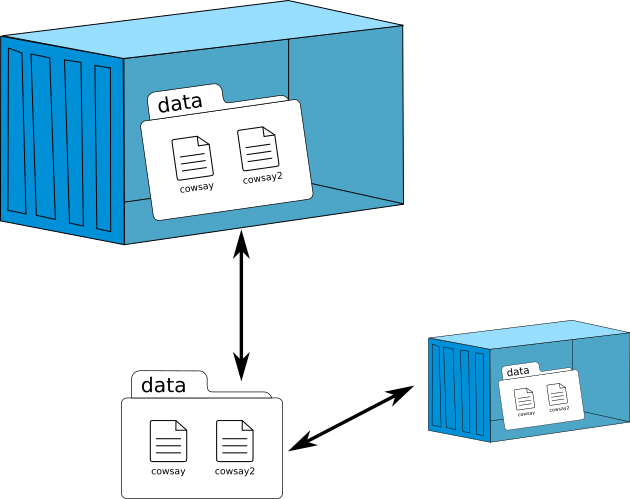

Note:
- Volumes are initialized when a container is created
- Data volumes can be shared and reused among containers
- Changes to a data volume are made directly
- Changes to a data volume will not be included when you update an image.
- Data volumes persist even if the container itself is deleted.
Data volumes are designed to persist data, independent of the container’s life cycle

----

### Data volume


----

### Data volume

```sh
bebatut$ ls data/
cowsay_Galaxy
bebatut$ docker run -t -i -v path/to/data:/data docker/whalesay
root@f4fa8ed32ef8:/cowsay# ls /data
cowsay_Galaxy
root@f4fa8ed32ef8:/cowsay# cowsay Galaxy2 > /data/cowsay_Galaxy2
root@f4fa8ed32ef8:/cowsay# ls /data
cowsay_Galaxy  cowsay_Galaxy2
root@f4fa8ed32ef8:/cowsay# exit
bebatut$ ls data/
cowsay_Galaxy	cowsay_Galaxy2
```

----

### Execution of commands <br>inside a running container


Note: Run a command in a running container

----

### `docker exec`

```sh
bebatut$ docker run -d docker/whalesay /bin/sh -c "while true; do sleep 1; done"
7179e85085ef14634f8b50f908a255707743dec0a5d1fd7fb3cd9036334d5177
bebatut$ docker exec 7179e85085ef14634f8b50f908a255707743dec0a5d1fd7fb3cd9036334d5177 \
cowsay Galaxy
 ________
< Galaxy >
 --------
    \
     \
      \
                    ##        .
              ## ## ##       ==
           ## ## ## ##      ===
       /""""""""""""""""___/ ===
  ~~~ {~~ ~~~~ ~~~ ~~~~ ~~ ~ /  ===- ~~~
       \______ o          __/
        \    \        __/
          \____\______/
```


----

### Stop/Start containers


Note: Sending SIGTERM and then SIGKILL after a grace period

----

### `docker stop` & `docker start`

```sh
bebatut$ docker stop 7179e85085ef14634f8b50f908a255707743dec0a5d1fd7fb3cd9036334d5177
7179e85085ef14634f8b50f908a255707743dec0a5d1fd7fb3cd9036334d5177
bebatut$
bebatut$ docker exec 7179e85085ef14634f8b50f908a255707743dec0a5d1fd7fb3cd9036334d5177 \
cowsay Galaxy
Error response from daemon: Container 7179e85085ef14634f8b50f908a255707743dec0a5d1fd7fb3cd9036334d5177 \
is not running
bebatut$
bebatut$ docker start 7179e85085ef14634f8b50f908a255707743dec0a5d1fd7fb3cd9036334d5177
7179e85085ef14634f8b50f908a255707743dec0a5d1fd7fb3cd9036334d5177
bebatut$
bebatut$ docker exec 7179e85085ef14634f8b50f908a255707743dec0a5d1fd7fb3cd9036334d5177 \
cowsay Galaxy
 ________
< Galaxy >
 --------
    \
     \
      \
                    ##        .
              ## ## ##       ==
           ## ## ## ##      ===
       /""""""""""""""""___/ ===
  ~~~ {~~ ~~~~ ~~~ ~~~~ ~~ ~ /  ===- ~~~
       \______ o          __/
        \    \        __/
          \____\______/
```

----

### View all containers

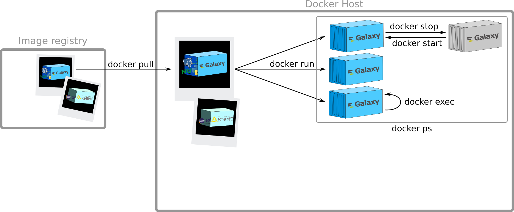

----

### `docker ps`

```sh
bebatut$ docker ps
CONTAINER ID        IMAGE               COMMAND                  CREATED             STATUS              PORTS               NAMES
7179e85085ef        docker/whalesay     "/bin/sh -c 'while tr"   12 minutes ago      Up 2 seconds                            agitated_lovelace
bebatut$
bebatut$ docker ps -a
CONTAINER ID        IMAGE                  COMMAND                  CREATED             STATUS                          PORTS               NAMES
7de97f8dd5eb        docker/whalesay        "/bin/bash"              4 minutes ago       Exited (0) About a minute ago                       trusting_swanson
9218bbee9c48        docker/whalesay        "/bin/bash"              5 minutes ago       Exited (0) 4 minutes ago                            evil_swirles
7179e85085ef        docker/whalesay        "/bin/sh -c 'while tr"   13 minutes ago      Up 55 seconds                                       agitated_lovelace
ad275579c454        ubuntu                 "/bin/sh -c 'while tr"   15 minutes ago      Exited (137) 13 minutes ago                         condescending_mestorf
66179c4d16da        ubuntu                 "/bin/bash"              About an hour ago   Exited (130) 15 minutes ago                         determined_pasteur
27386c8b69b3        ubuntu                 "/bin/sh"                About an hour ago   Exited (0) About an hour ago                        lonely_ramanujan
4cfefa19e6fa        docker/whalesay        "/bin/bash"              About an hour ago   Exited (0) About an hour ago                        thirsty_chandrasekhar
82687eb94ab9        docker/whalesay        "cowsay Galaxy"          2 hours ago         Exited (0) 2 hours ago                              fervent_babbage
6dbabb9384ad        tmp-bioconda-builder   "/usr/local/bin/tini "   8 days ago          Exited (0) 7 days ago                               tender_bhaskara
5d6f09b94727        tmp-bioconda-builder   "/usr/local/bin/tini "   8 days ago          Exited (0) 8 days ago                               jolly_brattain
4e6f38b4c34c        tmp-bioconda-builder   "/usr/local/bin/tini "   8 days ago          Created                                             angry_colden
b3e6c7412a75        tmp-bioconda-builder   "/usr/local/bin/tini "   8 days ago          Created                                             desperate_visvesvaraya
1ec56c9e37f8        tmp-bioconda-builder   "/usr/local/bin/tini "   8 days ago          Created                                             hopeful_khorana
2b129d00eb10        tmp-bioconda-builder   "/usr/local/bin/tini "   8 days ago          Created                                             gigantic_ptolemy
da45ab698f58        fb77c13d04c0           "/usr/local/bin/tini "   13 days ago         Exited (0) 13 days ago                              jovial_yalow
48dc3ed4e173        fb77c13d04c0           "/usr/local/bin/tini "   13 days ago         Created                                             focused_ritchie
e9195b6512dd        a2107450fdf2           "/usr/local/bin/tini "   2 weeks ago         Created                                             thirsty_bardeen
```

----

### Creation of a new image

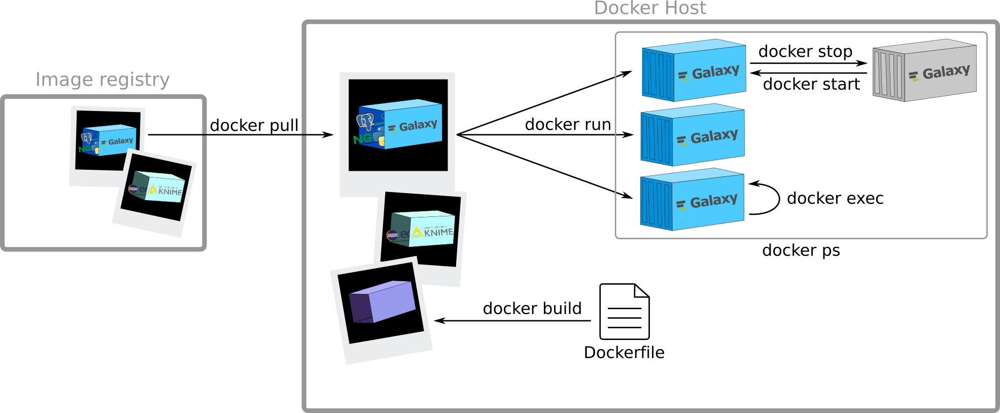

----

### View all images


----

### Push your image on a registry

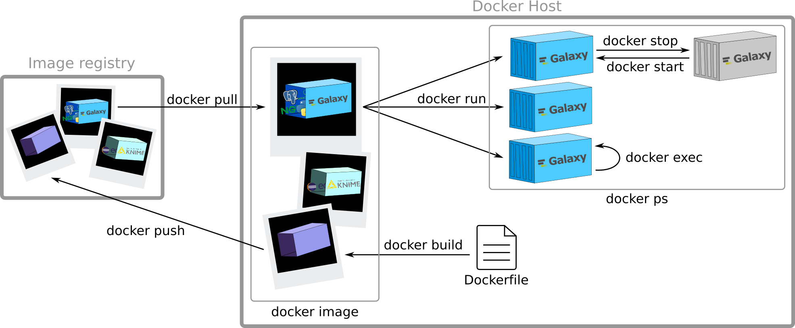

----

### Docker in a picture

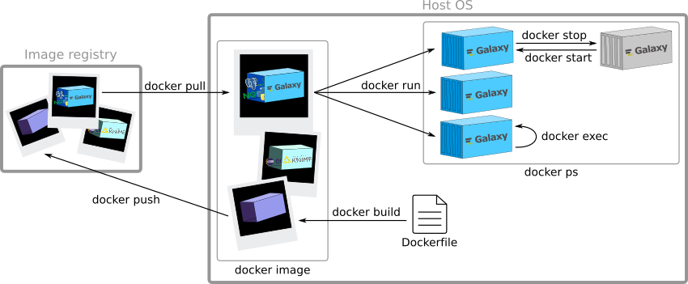

----

### <i class="fa fa-pencil"></i> Hands on!

Play with ...

---

## How to containerize your tools?


----

### How to create your image?


----

### A Dockerfile?

A text document that contains all the commands a user could call on the command line to assemble an image

```sh
# Comment
INSTRUCTION arguments
```

----

### The instructions <br>[`FROM`](https://docs.docker.com/engine/reference/builder/#from)

```sh
# Galaxy - Stable
#
# VERSION       Galaxy-central

FROM toolshed/requirements
...
```

<small>
[Galaxy Dockerfile](https://github.com/bgruening/docker-galaxy-stable/blob/master/galaxy/Dockerfile)
</small>

Note: the Base Image for subsequent instructions

- FROM must be the first non-comment instruction in the Dockerfile.
- FROM can appear multiple times within a single Dockerfile in order to create multiple images. Simply make a note of the last image ID output by the commit before each new FROM command

----

### The instructions <br>[`MAINTAINER`](https://docs.docker.com/engine/reference/builder/#/maintainer)

```sh
...
MAINTAINER Björn A. Grüning, bjoern.gruening@gmail.com
...
```

Note: Author field of the generated images

----

### The instructions <br>[`ENV`](https://docs.docker.com/engine/reference/builder/#env)

```sh
...
ENV GALAXY_RELEASE=release_16.07 \
GALAXY_REPO=https://github.com/galaxyproject/galaxy \
GALAXY_ROOT=/galaxy-central \
GALAXY_CONFIG_DIR=/etc/galaxy
...
```

Note: sets the environment variable

----

### The instructions <br>[`RUN`](https://docs.docker.com/engine/reference/builder/#run)

```sh
...
# Create the postgres user before apt-get does (with the configured UID/GID) to facilitate sharing /export/postgresql with non-Linux hosts
RUN groupadd -r postgres -g $GALAXY_POSTGRES_GID && \
    adduser --system --quiet --home /var/lib/postgresql --no-create-home --shell /bin/bash --gecos "" --uid $GALAXY_POSTGRES_UID --gid $GALAXY_POSTGRES_GID postgres

RUN apt-get -qq update && apt-get install --no-install-recommends -y apt-transport-https software-properties-common wget && \
    apt-key adv --keyserver hkp://p80.pool.sks-keyservers.net:80 --recv-keys 58118E89F3A912897C070ADBF76221572C52609D && \
    sh -c "echo deb https://get.docker.io/ubuntu docker main > /etc/apt/sources.list.d/docker.list" && \
    sh -c "echo deb http://research.cs.wisc.edu/htcondor/ubuntu/stable/ trusty contrib > /etc/apt/sources.list.d/htcondor.list" && \
    sh -c "wget -qO - http://research.cs.wisc.edu/htcondor/ubuntu/HTCondor-Release.gpg.key | sudo apt-key add -" && \
    apt-add-repository -y ppa:ansible/ansible && \
    apt-add-repository -y ppa:galaxyproject/nginx && \
    apt-get update -qq && apt-get upgrade -y && \
    apt-get install --no-install-recommends -y mercurial python-psycopg2 postgresql-9.3 sudo samtools python-virtualenv \
    nginx-extras=1.4.6-1ubuntu3.4ppa1 nginx-common=1.4.6-1ubuntu3.4ppa1 uwsgi uwsgi-plugin-python supervisor lxc-docker-1.9.1 slurm-llnl slurm-llnl-torque libswitch-perl \
    slurm-drmaa-dev proftpd proftpd-mod-pgsql libyaml-dev nodejs-legacy npm ansible \
    nano nmap lynx vim curl python-crypto python-pip python-gnuplot python-rpy2 python-psutil condor python-ldap \
    gridengine-common gridengine-drmaa1.0 && \
    pip install --upgrade pip && \
    pip install ephemeris && \
    apt-get purge -y software-properties-common && \
    apt-get autoremove -y && apt-get clean && rm -rf /var/lib/apt/lists/* /tmp/* /var/tmp/*
...
```

Note: any commands in a new layer on top of the current image and commit the results

----

### The instructions <br>[`ADD`](https://docs.docker.com/engine/reference/builder/#add)

```sh
...
ADD ./bashrc $GALAXY_HOME/.bashrc
...
```

<i class="fa fa-exclamation-triangle"></i> `COPY` is functionally similar to `ADD` but is preferred

Note: copies new files, directories or remote file URLs from <src> and adds them to the filesystem of the container at the path <dest>

rules:

- The <src> path must be inside the context of the build
- If <src> is a URL and <dest> does not end with a trailing slash, then a file is downloaded from the URL and copied to <dest>
- If <src> is a URL and <dest> does end with a trailing slash, then the filename is inferred from the URL and the file is downloaded to <dest>/<filename>.
- If <src> is a directory, the entire contents of the directory are copied, including filesystem metadata
- If <src> is a local tar archive in a recognized compression format (identity, gzip, bzip2 or xz) then it is unpacked as a directory
- If <src> is any other kind of file, it is copied individually along with its metadata
- If multiple <src> resources are specified, either directly or due to the use of a wildcard, then <dest> must be a directory, and it must end with a slash /
- If <dest> does not end with a trailing slash, it will be considered a regular file and the contents of <src> will be written at <dest>
- If <dest> doesn’t exist, it is created along with all missing directories in its path

COPY is more transparent than ADD. COPY only supports the basic copying of local files into the container, while ADD has some features (like local-only tar extraction and remote URL support) that are not immediately obvious. Consequently, the best use for ADD is local tar file auto-extraction into the image

----

### The instructions <br>[`USER`](https://docs.docker.com/engine/reference/builder/#user)


```sh
...
# The following commands will be executed as User galaxy
USER galaxy
...
```

Note: sets the user name or UID to use when running the image and for any `RUN`, `CMD` and `ENTRYPOINT` instructions that follow it in the Dockerfile

----

### The instructions <br>[`WORKDIR`](https://docs.docker.com/engine/reference/builder/#workdir)

```sh
...
WORKDIR $GALAXY_ROOT
...
```

Note: sets the working directory for any `RUN`, `CMD`, `ENTRYPOINT`, `COPY` and `ADD` instructions that follow it in the Dockerfile

----

### The instructions <br>[`EXPOSE`](https://docs.docker.com/engine/reference/builder/#expose)

```sh
...
# Expose port 80 (webserver), 21 (FTP server), 8800 (Proxy), 9002 (supvisord web app)
EXPOSE :80
EXPOSE :21
EXPOSE :8800
EXPOSE :9002
...
```

Note: Informs Docker that the container listens on the specified network ports at runtime

EXPOSE does not make the ports of the container accessible to the host. To do that, you must use either the -p flag to publish a range of ports or the -P flag to publish all of the exposed ports

----

### The instructions <br>[`VOLUME`](https://docs.docker.com/engine/reference/builder/#volume)

```sh
...
# Mark folders as imported from the host.
VOLUME ["/export/", "/data/", "/var/lib/docker"]
...
```

Note: creates a mount point with the specified name and marks it as holding externally mounted volumes from native host or other containers

----

### The instructions <br>[`CMD`](https://docs.docker.com/engine/reference/builder/#cmd)

```sh
...
# Autostart script that is invoked during container start
CMD ["/usr/bin/startup"]
```

Note:
- only be one CMD instruction in a Dockerfile
- The main purpose of a CMD is to provide defaults for an executing container

----

### [Best practices](https://docs.docker.com/engine/userguide/eng-image/dockerfile_best-practices/)

- Containers should be ephemeral
- Use a `.dockerignore` file
- Avoid installing unnecessary packages
- Run only one process per container
- Minimize the number of layers
- Sort multi-line arguments
- Build cache

Note:
- Containers should be ephemeral
    The container produced by the image your Dockerfile defines should be as ephemeral as possible. By “ephemeral,” we mean that it can be stopped and destroyed and a new one built and put in place with an absolute minimum of set-up and configuration.
- `.dockerignore` file
    In most cases, it’s best to put each Dockerfile in an empty directory. Then, add to that directory only the files needed for building the Dockerfile. To increase the build’s performance, you can exclude files and directories by adding a .dockerignore file to that directory as well. This file supports exclusion patterns similar to .gitignore files. For information on creating one, see the .dockerignore file.
- unnecessary packages
    In order to reduce complexity, dependencies, file sizes, and build times, you should avoid installing extra or unnecessary packages just because they might be “nice to have.” For example, you don’t need to include a text editor in a database image.
- Run only one process per container
    In almost all cases, you should only run a single process in a single container. Decoupling applications into multiple containers makes it much easier to scale horizontally and reuse containers. If that service depends on another service, make use of container linking.
- Minimize the number of layers
    You need to find the balance between readability (and thus long-term maintainability) of the Dockerfile and minimizing the number of layers it uses. Be strategic and cautious about the number of layers you use.
- Sort multi-line arguments
    Whenever possible, ease later changes by sorting multi-line arguments alphanumerically. This will help you avoid duplication of packages and make the list much easier to update. This also makes PRs a lot easier to read and review. Adding a space before a backslash (\) helps as well.
- Build cache

----

### Creating the image

```sh
bebatut$ docker build -f /path/to/a/Dockerfile .
```

----

### <i class="fa fa-pencil"></i> Hands on!

Create an image for your favorite tool

---


----

### BioContainers?

> A community-driven project that provides <br>the infrastructure and basic guidelines to <br>create, manage and distribute <br>Bioinformatics Docker containers

[http://biocontainers.pro/](http://biocontainers.pro/)

----

### 2017 BioContainers

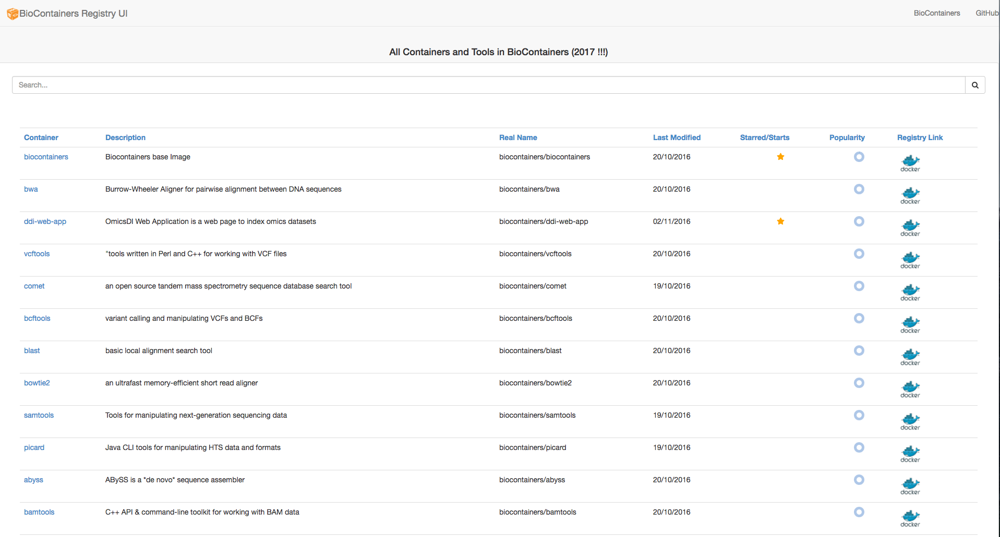

<small>[http://biocontainers.pro/registry/](http://biocontainers.pro/registry/#/)</small>

----

### BioContainers specifications

```sh
# Base Image
FROM biocontainers/biocontainers:latest

# Metadata
LABEL base.image="biocontainers:latest"
LABEL version="3"
LABEL software="Comet"
LABEL software.version="2016012"
LABEL description="an open source tandem mass spectrometry sequence database search tool"
LABEL website="http://comet-ms.sourceforge.net/"
LABEL documentation="http://comet-ms.sourceforge.net/parameters/parameters_2016010/"
LABEL license="http://comet-ms.sourceforge.net/"
LABEL tags="Proteomics"

# Maintainer
MAINTAINER Felipe da Veiga Leprevost

...
```

----

### Too much work to write a <br>BioContainer for a single tool?

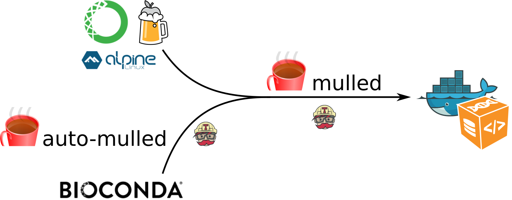

----

### 

- Open Source package manager
- Independent of any programming language and OS
- Fast, robust and easy package installation

  ```
  $ conda install deeptools
  ```
  
- Installation and management of multiple versions

Note: 
- Independent of any programming language and OS: if developed first for python tools
- Less than 1 minute to install deeptools with conda

----

### A Conda package<br><i class="fa fa-long-arrow-right"></i> Easy to write!

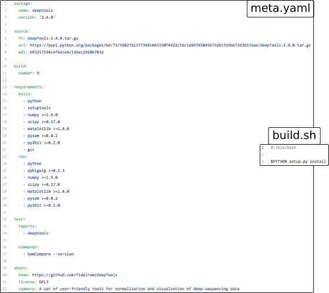


Note: Only 2 files + Extensive documentation

----

### <br>for bioinformatics tools


- More than 1,700 bioinformatics packages
- Big, fast-growing and newcomer-friendly community

Note: 
- Bioconda: a distribution of bioinformatics softwares using Conda
- Started a year ago
- Big (how much?)
If you have a tool, we recommend you to develop a bioconda package for this


----

### <i class="fa fa-pencil"></i> Hands on!

Develop a BioContainer for your favorite tool


