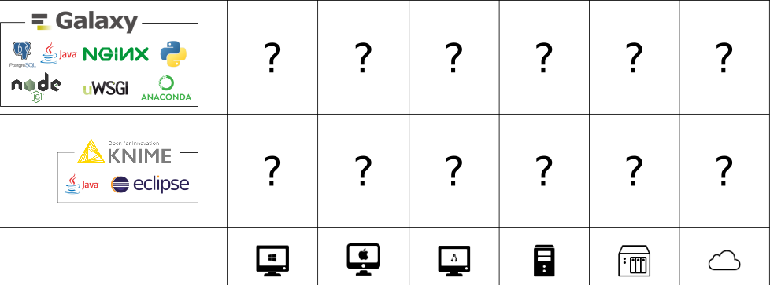

Hello! I am [Bérénice](http://bebatut.fr/), the author of following slides.

<small>
This slide does not exist in original deck. It is useful if you are not familiar with [Reveal.JS](https://github.com/hakimel/reveal.js), used here.
</small>

The easiest way to navigate this slide deck is by hitting `[space]`on your keyboard.

---

### Docker, its possibilities and how to start

Bérénice Batut

<small>
University of Freiburg  3rd Systems Biology Developers Foundry  Frankfurt - December 2016
</small>

Note: How many of you have already
- heard about Docker?
- used Docker?
- create a Docker container?

---

## <i class="fa fa-calendar-o"></i> Agenda

1. Why Docker? What is it?
2. How to use Docker?
3. How to containerize your tools?
4. How to make it interact with other containerized tools?

---

## Why Docker?  What is it?

----

### Reproducibility in bioinformatics

Deployment issues
- Different environment
- Different OS
- Different packaging
- Conflict between tools or versions

----

### Deployment issue

----

### Deployment issue

Matrix from Hell

----

### Transport Pre 1960

----

### Transport Pre 1960

Matrix from Hell

----

### Intermodal shipping container

Note: A standard container that is loaded with virtually any goods and stays sealed until it reaches final delivery. In btw can be loaded and unloaded, stacked, transported efficiently over long distances and transferred from one mode of transport to another

----

### Docker

Note: An engine that enables any payload to be encapsulated as a lightweight, portable, self sufficient container, that can be manipulated using standard operations and run consistently on virtually any hardware platform

----

### A Docker container?

Lightweight, Open, Secure by default

Note:
- lightweight: same OS kernel, instant start, less RAM use
- open: open standard, run on all major unix distributions and windows
- secure by default: containers isolate applications from one another and the underlying infrastructure

----

### Virtual machines vs Containers

Containers more portable and efficient

Note:
- Similar resource isolation and allocation benefits for containers and VM
- but a different architectural approach
- VM: include the application, the necessary binaries and libraries, and an entire guest operating system -- all of which can amount to tens of GBs
- Container: application and all of its dependencies --but share the kernel with other containers, running as isolated processes in user space on the host operating system

---

## How to use Docker?

----

### The client

----

### The Big Picture

---

# How to containerize your tools?

---

# How to make it interact with other containerized tools?
